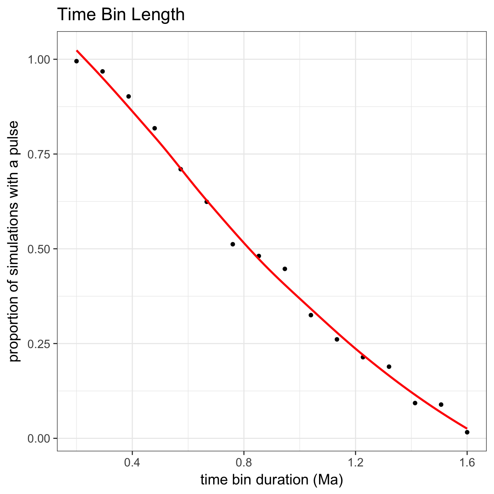
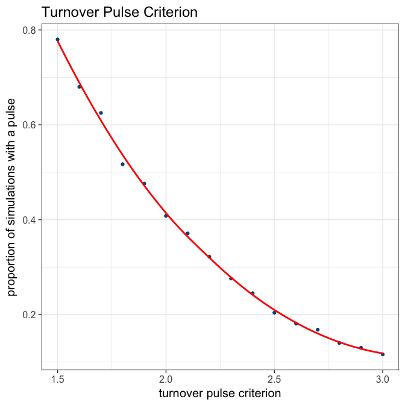
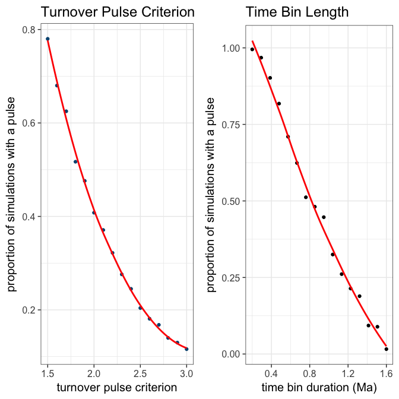

# 1000 Trees - Analysis and Plots for Analytical Parameters
Andrew Barr  

```r
knitr::opts_chunk$set(fig.width=7, fig.height=7)
library(ggplot2)
```

```
## Warning: package 'ggplot2' was built under R version 3.3.2
```

```r
library(NullTurnover)
theme_set(theme_bw(15))
oneThousandTrees <- readRDS(file = "~/Dropbox/TurnoverPulseRedux/NullTurnover/Analysis_Paleobio_Manuscript/ThousandTrees.RDS")
```

### test bin number


```r
binWidths <- seq(0.2, 1.6, length=16)

proportionsForBin <- sapply(binWidths, FUN=function(x){
  pulseTests <- detectPulses(oneThousandTrees, binLength = x)
  pulses <- sapply(pulseTests, function(x) return(sum(x$isPulse, na.rm=TRUE)))
  return(sum(pulses>0, na.rm=T) / length(pulses))
})
```

```
## Loading required package: paleotree
```

```
## Loading required package: ape
```

```
## Warning: package 'ape' was built under R version 3.3.2
```


```r
gapSize <- (max(binWidths) - min(binWidths)) * 0.025
binDuration <- qplot(x=binWidths, y=proportionsForBin, geom="point", fill=I("#045480")) +
  labs(x="time bin duration (Ma)", y="proportion of simulations with a pulse", title="Time Bin Length") + 
  stat_smooth(method="loess", se=F, col="red") 
  #coord_flip() 
  #annotate("text", y=0.23, x=0.4, label="p<0.0001, r^2=0.99", size=8)
binDuration
```

<!-- -->

```r
#ggsave("binPlot.pdf",path="~/Dropbox/TurnoverPulseRedux/PaleoAnth_2016/", width=7, height=7, units="in",useDingbats=FALSE)
summary(lm(binWidths~proportionsForBin))
```

```
## 
## Call:
## lm(formula = binWidths ~ proportionsForBin)
## 
## Residuals:
##       Min        1Q    Median        3Q       Max 
## -0.093976 -0.038180 -0.004309  0.040942  0.084276 
## 
## Coefficients:
##                   Estimate Std. Error t value Pr(>|t|)    
## (Intercept)        1.54199    0.02484   62.08  < 2e-16 ***
## proportionsForBin -1.34377    0.04329  -31.04  2.6e-14 ***
## ---
## Signif. codes:  0 '***' 0.001 '**' 0.01 '*' 0.05 '.' 0.1 ' ' 1
## 
## Residual standard error: 0.05504 on 14 degrees of freedom
## Multiple R-squared:  0.9857,	Adjusted R-squared:  0.9847 
## F-statistic: 963.7 on 1 and 14 DF,  p-value: 2.602e-14
```

### Test pulse criterion


```r
criteria <- seq(1.5, 3, length=16)

proportionsForPulse <- sapply(criteria, FUN=function(x){
  pulseTests <- detectPulses(oneThousandTrees, criterion = x, binLength = 0.5)
  pulses <- sapply(pulseTests, function(x) return(sum(x$isPulse, na.rm=TRUE)))
  return(sum(pulses>0, na.rm=T) / length(pulses))
})
```


```r
gapSize <- (max(criteria) - min(criteria)) * 0.025
criterion <- qplot(criteria, y=proportionsForPulse, geom="point", color=I("#045480")) + 
  stat_smooth(method="loess", se=F, col="red") + 
  labs(x="turnover pulse criterion", y="proportion of simulations with a pulse", title="Turnover Pulse Criterion") 
  #coord_flip()  
  #annotate("text", x=1.6, y=0.22, label="p<0.0001, r^2=0.92", size=8) 
criterion
```

<!-- -->

```r
#ggsave("criterion.pdf",path="~/Dropbox/TurnoverPulseRedux/PaleoAnth_2016/", width=7, height=7, units="in",useDingbats=FALSE)
summary(lm(criteria~proportionsForPulse))
```

```
## 
## Call:
## lm(formula = criteria ~ proportionsForPulse)
## 
## Residuals:
##      Min       1Q   Median       3Q      Max 
## -0.12835 -0.09462 -0.05017  0.07160  0.23234 
## 
## Coefficients:
##                     Estimate Std. Error t value Pr(>|t|)    
## (Intercept)          3.02164    0.06188   48.83  < 2e-16 ***
## proportionsForPulse -2.18943    0.15200  -14.40 8.69e-10 ***
## ---
## Signif. codes:  0 '***' 0.001 '**' 0.01 '*' 0.05 '.' 0.1 ' ' 1
## 
## Residual standard error: 0.1239 on 14 degrees of freedom
## Multiple R-squared:  0.9368,	Adjusted R-squared:  0.9323 
## F-statistic: 207.5 on 1 and 14 DF,  p-value: 8.692e-10
```


```r
library(gridExtra)
bothPlots <- grid.arrange(criterion, binDuration,ncol=2)
```

<!-- -->

```r
ggsave("analyticalParameters.pdf", bothPlots, width=8, height=4)
```
