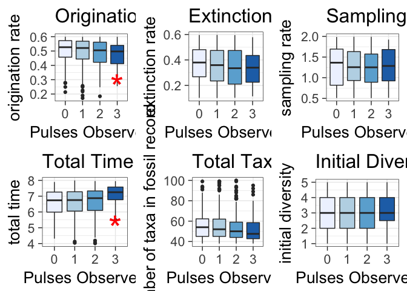
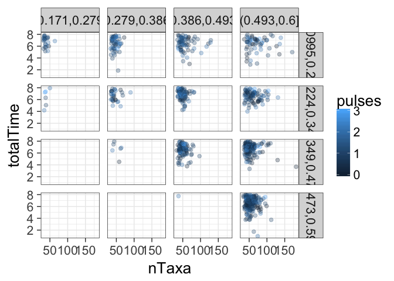

# 1000 trees - Analysis and Graphs of Simulation Parameters
Andrew Barr  
03/16/2017  


```r
library(ggplot2)
```

```
## Warning: package 'ggplot2' was built under R version 3.3.2
```

```r
library(paleotree)
```

```
## Loading required package: ape
```

```
## Warning: package 'ape' was built under R version 3.3.2
```

```r
library(NullTurnover)
library(knitr)
```

```
## Warning: package 'knitr' was built under R version 3.3.2
```

```r
theme_set(theme_bw(20))
thousandTrees <- readRDS(file = "/Users/wabarr/Dropbox/TurnoverPulseRedux/NullTurnover/Analysis_Paleobio_Manuscript/ThousandTrees.RDS")
```


```r
params <- lapply(thousandTrees, FUN=function(x) return(x$theParameters[1,c("origRateSim","extRateSim","sampRateSim","startTaxa")]))
params <- do.call(rbind, params)

pulseTests <- detectPulses(thousandTrees, binLength = 0.5)
pulses <- sapply(pulseTests, function(x) return(sum(x$isPulse, na.rm=TRUE)))

nTaxa <- sapply(thousandTrees,FUN=function(x) return(length(x$theRecord)))
totalTime <- sapply(thousandTrees,FUN=function(x) {
  return(x$theRecord$t1$sampling.times[1])
})

forPlot <- data.frame(params, pulses, nTaxa, totalTime)

## list for holding linear model results
lmods <- list()
```

## All boxplots are for set analytical parameters 

Bin length = 0.5, criterion = 1.5 * IQR (default)

## number of taxa


```r
nTaxaPlot <- qplot(x=factor(pulses), y=nTaxa, fill=factor(pulses), geom="boxplot") + 
  scale_fill_brewer(palette = "Blues", guide="none") + 
  labs(x="Pulses Observed", y="number of taxa in fossil record", title="Total Taxa in Record") + 
  scale_y_continuous(limits=c(38, 100)) 
  #annotate("text", x=4, y=90, label="NS", size=8, color="red")
lmods$ntaxa <- lm(nTaxa~factor(pulses))
ggsave( "ntaxa.pdf",nTaxaPlot, width=120, height=170, units="mm", useDingbats=FALSE)
```

```
## Warning: Removed 80 rows containing non-finite values (stat_boxplot).
```

## total time sampled


```r
totalTimePlot <- qplot(x=factor(pulses), y=totalTime, fill=factor(pulses), geom="boxplot") + 
  scale_fill_brewer(palette = "Blues", guide="none") + 
  labs(x="Pulses Observed", y="total time", title="Total Time") + 
  scale_y_continuous(limits=c(4, 8)) + 
  annotate("text", x=4, y=5, label="*", size=15, color="red")
lmods$totalTime <- lm(totalTime~factor(pulses))
ggsave("totalTime.pdf",totalTimePlot, width=120, height=170, units="mm")
```

```
## Warning: Removed 156 rows containing non-finite values (stat_boxplot).
```

## Inital diversity


```r
initialDiversityPlot <- qplot(x=factor(pulses), y=params$startTaxa, fill=factor(pulses), geom="boxplot") + 
  scale_fill_brewer(palette = "Blues", guide="none") + 
  labs(x="Pulses Observed", y="initial diversity", title="Initial Diversity") 
  #annotate("text", x=1.5, y=1.5, label="NS", size=8, color="red")
lmods$startTaxa <- lm(params$startTaxa~factor(pulses))
ggsave( "initialDiversity.pdf", initialDiversityPlot,width=120, height=170, units="mm")
```

## sampling rate


```r
samplingRatePlot <- 
  qplot(x=factor(pulses), y=params$sampRateSim, fill=factor(pulses), geom="boxplot") + 
  scale_fill_brewer(palette = "Blues", guide="none") + 
  labs(x="Pulses Observed", y="sampling rate", title="Sampling Rate") 
  #annotate("text", x=3.9, y=1.8, label="NS", size=8, color="red")
lmods$sampRateSim <- lm(params$sampRateSim~factor(pulses))
ggsave( "samplingRate.pdf",samplingRatePlot, width=120, height=170, units="mm")
```

##  extinction rate


```r
extinctionPlot <- 
  qplot(x=factor(pulses), y=params$extRateSim, fill=factor(pulses), geom="boxplot") + 
  scale_fill_brewer(palette = "Blues", guide="none") + 
  labs(x="Pulses Observed", y="extinction rate", title="Extinction Rate") 
  #annotate("text", x=3.5, y=0.13, label="NS", size=8, color="red")
lmods$extRateSim <- lm(params$extRateSim~factor(pulses))
ggsave( "extinctionRate.pdf", extinctionPlot,width=120, height=170, units="mm")
```

## origination rate


```r
originationPlot <- 
  qplot(x=factor(pulses), y=params$origRateSim, fill=factor(pulses), geom="boxplot") + 
  scale_fill_brewer(palette = "Blues", guide="none") + 
  labs(x="Pulses Observed", y="origination rate", title="Origination Rate") + 
  annotate("text", x=4, y=0.25, label="*", size=15, color="red")
lmods$origRateSim <- lm(params$origRateSim~factor(pulses))
ggsave("originationRate.pdf",originationPlot, width=120, height=170, units="mm")
```

## linear models


```r
summaries <- lapply(1:length(lmods), FUN=function(modelIndex){
  summ <- summary(lmods[[modelIndex]])
  theANOVAtable <- anova(lmods[[modelIndex]])
  data.frame(var=names(lmods)[modelIndex], r2=round(summ$r.square,3), p=round(theANOVAtable$Pr[1],3), f=round(theANOVAtable$F[1],3), slope=coef(lmods[[modelIndex]])[2])
})
do.call(rbind, summaries)
```

```
##                          var    r2     p     f        slope
## factor(pulses)1        ntaxa 0.003 0.328 1.150 -1.093787534
## factor(pulses)11   totalTime 0.022 0.000 6.533  0.021029165
## factor(pulses)12   startTaxa 0.003 0.331 1.143  0.109235867
## factor(pulses)13 sampRateSim 0.001 0.833 0.289 -0.008092885
## factor(pulses)14  extRateSim 0.005 0.167 1.694 -0.007308035
## factor(pulses)15 origRateSim 0.014 0.003 4.598 -0.011670820
```

## All simulation parameters plot


```r
library(gridExtra)
fullPlot <- grid.arrange(originationPlot, extinctionPlot, samplingRatePlot, totalTimePlot, nTaxaPlot, initialDiversityPlot, ncol=3)
```

```
## Warning: Removed 156 rows containing non-finite values (stat_boxplot).
```

```
## Warning: Removed 80 rows containing non-finite values (stat_boxplot).
```

<!-- -->

```r
ggsave("allSimulationParameters.pdf", fullPlot, width = 14, height=8)
```

## pulses

```r
meltedForPlot <- reshape2::melt(forPlot, id=c("nTaxa", "totalTime", "pulses"))
forPlot$origRateCategory <- cut(forPlot$origRateSim, 4)
forPlot$extRateCategory <- cut(forPlot$extRateSim, 4)
ggplot(forPlot, aes(x=nTaxa, y=totalTime, color=pulses)) + 
  geom_point(alpha=0.3, size=2) + 
  facet_grid(extRateCategory~origRateCategory)
```

```
## Warning: Removed 136 rows containing missing values (geom_point).
```

<!-- -->
