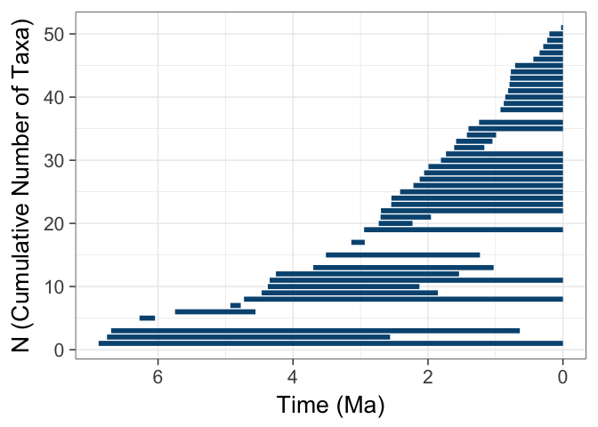
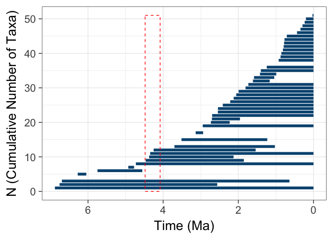
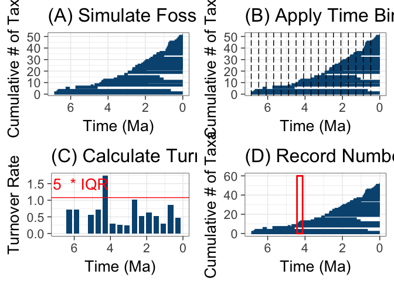
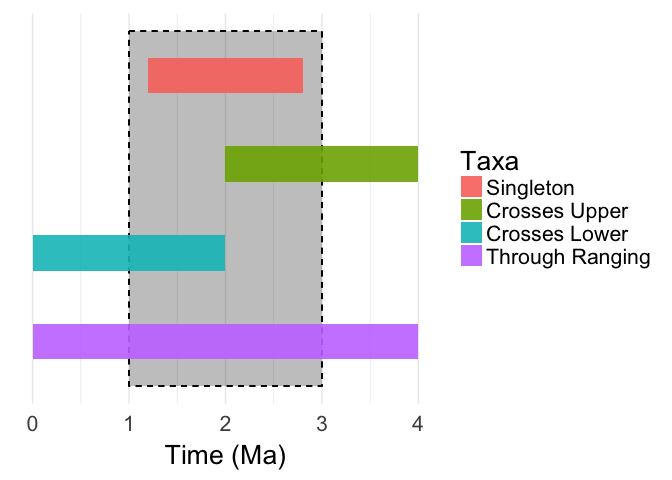

# NewSchematicFigureMethods
Andrew Barr  
March 16, 2017  

```r
library(NullTurnover)
library(gridExtra)
set.seed(1236)
```


```r
params <- list(
    origRateSim = 0.6, 
    extRateSim = 0.2,
    totalTime=7, 
    sampRateSim = 1,
    nruns = 1, 
    plot=FALSE,
    startTaxa = 5, 
    nSamp = c(30,70),
    nExtant=c(0,500),
    nTotalTaxa = c(0,500),
    maxAttempts = Inf
  )
recs <- do.call(simRecords, params)
```

```
## Loading required package: paleotree
```

```
## Loading required package: ape
```

```
## Warning: package 'ape' was built under R version 3.3.2
```

```r
ranges <- fossilRecord2fossilRanges(recs[[1]][[1]])


basicPlot <- plotRanges(ranges, returnValue = T)
```

```
## Warning: package 'ggplot2' was built under R version 3.3.2
```

```
## Warning in data.row.names(row.names, rowsi, i): some row.names duplicated:
## 15,17,20,32,39,42,47 --> row.names NOT used
```

```r
basicPlot
```

<!-- -->

```r
binL <- 0.4
criterion<- 1.5

pulsePlot <- detectPulses(recs, plot = T, binLength = binL, criterion=criterion)
```

```
## Warning in data.row.names(row.names, rowsi, i): some row.names duplicated:
## 15,17,20,32,39,42,47 --> row.names NOT used
```

```
##    int.start    int.end     pRate isPulse
## 1  6.8808448 6.48084478        NA      NA
## 2  6.4808448 6.08084478 0.7192052   FALSE
## 3  6.0808448 5.68084478 0.7192052   FALSE
## 4  5.6808448 5.28084478 0.0000000   FALSE
## 5  5.2808448 4.88084478 0.5578589   FALSE
## 6  4.8808448 4.48084478 0.7192052   FALSE
## 7  4.4808448 4.08084478 1.7328680    TRUE
## 8  4.0808448 3.68084478 0.2944576   FALSE
## 9  3.6808448 3.28084478 0.2634013   FALSE
## 10 3.2808448 2.88084478 0.2382754   FALSE
## 11 2.8808448 2.48084478 1.0136628   FALSE
## 12 2.4808448 2.08084478 0.5190984   FALSE
## 13 2.0808448 1.68084478 0.6282861   FALSE
## 14 1.6808448 1.28084478 0.5282727   FALSE
## 15 1.2808448 0.88084478 0.2944576   FALSE
## 16 0.8808448 0.48084478 0.8621012   FALSE
## 17 0.4808448 0.08084478 0.4731050   FALSE
```

<!-- -->

```r
pulsePlot
```

```
## [[1]]
## [[1]][[1]]
##    int.start    int.end     pRate isPulse
## 1  6.8808448 6.48084478        NA      NA
## 2  6.4808448 6.08084478 0.7192052   FALSE
## 3  6.0808448 5.68084478 0.7192052   FALSE
## 4  5.6808448 5.28084478 0.0000000   FALSE
## 5  5.2808448 4.88084478 0.5578589   FALSE
## 6  4.8808448 4.48084478 0.7192052   FALSE
## 7  4.4808448 4.08084478 1.7328680    TRUE
## 8  4.0808448 3.68084478 0.2944576   FALSE
## 9  3.6808448 3.28084478 0.2634013   FALSE
## 10 3.2808448 2.88084478 0.2382754   FALSE
## 11 2.8808448 2.48084478 1.0136628   FALSE
## 12 2.4808448 2.08084478 0.5190984   FALSE
## 13 2.0808448 1.68084478 0.6282861   FALSE
## 14 1.6808448 1.28084478 0.5282727   FALSE
## 15 1.2808448 0.88084478 0.2944576   FALSE
## 16 0.8808448 0.48084478 0.8621012   FALSE
## 17 0.4808448 0.08084478 0.4731050   FALSE
```

```r
rates <- data.frame(getOrigRates(ranges, binLength = binL))
```


```r
panel1 <- basicPlot + labs(title="(A) Simulate Fossil Record", y="Cumulative # of Taxa")

panel2 <- basicPlot + 
           geom_vline(xintercept=rates$int.start, lty=5) + 
           labs(title="(B) Apply Time Bins",y="Cumulative # of Taxa")
panel3 <- ggplot(data=rates, 
                 aes(xmin=int.start-0.05, xmax=int.end+0.05, ymin=0, ymax=pRate)) + 
            geom_rect(fill="#045480") + 
            labs(x="Time (Ma)", y="Turnover Rate", title="(C) Calculate Turnover") + 
            theme_bw(20) + 
            geom_hline(yintercept = quantile(rates$pRate, 0.75, na.rm=TRUE) * criterion, col="red") + 
            annotate(geom="text", x=6, y=1.5,label=paste(criterion," * IQR"), col="red", size=7) + 
            scale_x_reverse(limits=c(6.92, 0))

panel4 <- basicPlot +
            geom_rect(data=subset(rates, pRate > quantile(pRate, 0.75, na.rm=TRUE) * criterion),
                      aes(xmin=int.start-0.05, xmax=int.end+0.05, ymin=0, ymax=60), inherit.aes = F, fill="transparent", color="red", size=1) + 
            labs(title="(D) Record Number of Pulses", y="Cumulative # of Taxa")
finalPlot <- grid.arrange(panel1, panel2, panel3, panel4, ncol=2, nrow=2)
```

```
## Warning: Removed 1 rows containing missing values (geom_rect).
```

<!-- -->

```r
ggsave("schematicMethods.pdf",finalPlot, width=10, height=10, units="in")
```

## Plot for foote taxon types


```r
dat <- data.frame(xmin=c(0,0,2,1.2), 
                  xmax=c(4,2,4,2.8), 
                  ymin=c(0,1,2,3), 
                  ymax=c(1,2,3,4), 
                  Taxa=factor(1:4))
levels(dat$Taxa) <- c("Through Ranging", "Crosses Lower", "Crosses Upper", "Singleton")
dat$Taxa <- ordered(dat$Taxa, levels=rev(levels(dat$Taxa)))
types_taxa <- ggplot(dat, aes(xmin=xmin, xmax=xmax, ymin=ymin+0.3, ymax=ymax-0.3)) + 
  geom_rect(aes(xmin=1, xmax=3, ymin=0, ymax=4), alpha=0.1, linetype=2, color="black") + 
  geom_rect(aes(fill=Taxa), alpha=0.9) + 
  theme_minimal(20) + 
  labs(x="Time (Ma)") + 
  scale_y_continuous(breaks=NULL)
types_taxa
```

<!-- -->

```r
#ggsave("foot_taxon_types.pdf", types_taxa, path="~/Dropbox/TurnoverPulseRedux/PaleoAnth_2016/", width=7, height=7, units="in")
```
