# Untitled
Andrew Barr  
October 20, 2015  


```r
library(ape)
```

```
## Warning: package 'ape' was built under R version 3.2.3
```

```r
library(NullTurnover)
library(ggplot2)
library(parallel)
library(dplyr)
```

```
## 
## Attaching package: 'dplyr'
```

```
## The following objects are masked from 'package:stats':
## 
##     filter, lag
```

```
## The following objects are masked from 'package:base':
## 
##     intersect, setdiff, setequal, union
```

```r
theme_set(theme_bw(20))
knitr::opts_knit$set(fig.width=10, fig.height=10)
```

Trees produced by `phytools::pbtree(bibiP, bibiQ, n=50, t=10)`, using the per interval Foote rate average for the period examined by Bibi & Kiessling. 


```r
treez <- readRDS("treez.Rdata")
```

## Criterion


```r
criteria <- seq(1.2, 1.9, 0.1)
criterionPulses <- mclapply(criteria, mc.cores=4, FUN=function(criterion){
  pulses <- sapply(treez, FUN=function(theTree){
    return(detectPulses(theTree, desiredBinNumber = 20, criterion = criterion)[[1]])
    })
  return(sum(pulses > 0) / length(pulses))
  })
```

```
## Warning in mclapply(criteria, mc.cores = 4, FUN = function(criterion) {:
## all scheduled cores encountered errors in user code
```


```r
qplot(xmin=criteria - 0.03, xmax=criteria + 0.03, ymin=0, ymax=unlist(criterionPulses), geom="rect") + 
  scale_x_continuous(breaks=criteria) + 
  labs(x="Turnover pulse criterion (* IQR)", y="Proportion trees with pulses")
```

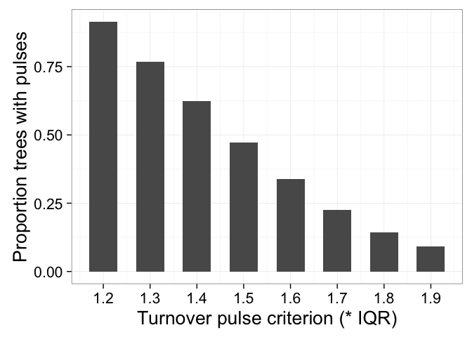\

## Sample size


```r
nTaxa <- sapply(treez, FUN=function(tree) {
  length(tree$tip.label)
})

summary(nTaxa)
```

```
##    Min. 1st Qu.  Median    Mean 3rd Qu.    Max. 
##   100.0   181.0   213.0   218.1   248.0   429.0
```

```r
nPulses <- sapply(treez, FUN=function(tree){
  detectPulses(tree, desiredBinNumber = 20)
})
summary(nPulses)
```

```
##    Min. 1st Qu.  Median    Mean 3rd Qu.    Max. 
##  0.0000  0.0000  0.0000  0.5935  1.0000  4.0000
```


```r
summary(lm(nTaxa~factor(nPulses)))
```

```
## 
## Call:
## lm(formula = nTaxa ~ factor(nPulses))
## 
## Residuals:
##      Min       1Q   Median       3Q      Max 
## -119.903  -37.443   -5.443   30.558  211.557 
## 
## Coefficients:
##                  Estimate Std. Error t value Pr(>|t|)    
## (Intercept)      217.4427     1.5396 141.231   <2e-16 ***
## factor(nPulses)1   2.4601     2.4075   1.022    0.307    
## factor(nPulses)2  -2.0035     3.9500  -0.507    0.612    
## factor(nPulses)3   0.1173    10.1195   0.012    0.991    
## factor(nPulses)4 -47.4427    50.0319  -0.948    0.343    
## ---
## Signif. codes:  0 '***' 0.001 '**' 0.01 '*' 0.05 '.' 0.1 ' ' 1
## 
## Residual standard error: 50.01 on 1995 degrees of freedom
## Multiple R-squared:  0.001298,	Adjusted R-squared:  -0.0007041 
## F-statistic: 0.6484 on 4 and 1995 DF,  p-value: 0.6281
```

```r
qplot(factor(nPulses), nTaxa, geom="boxplot", fill=factor(nPulses)) + 
  scale_fill_brewer(palette = "Blues", guide="none") + 
  labs(x="number of pulses detected", y="number of taxa") + 
  coord_flip()
```

\

```r
qplot(factor(nPulses), nTaxa, geom="violin", fill=factor(nPulses)) + 
  scale_fill_brewer(palette = "Blues", guide="none") + 
  labs(x="number of pulses detected", y="number of taxa") + 
  coord_flip()
```

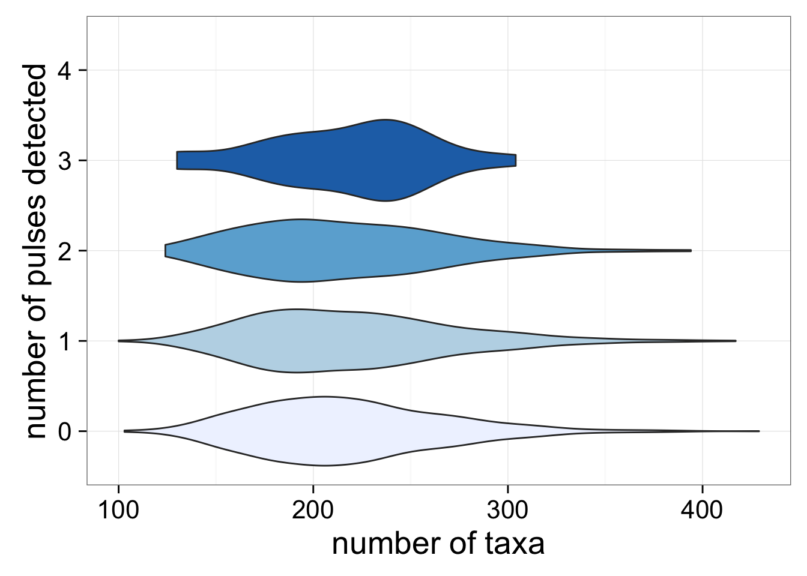\

## Bin number

*  For each bin number between 10 and 20, inclusive.
*  detect the number of pulses for each of the 2000 trees


```r
binNumberPulses <- mclapply(10:20, mc.cores=4, FUN=function(binNumber) {
 nPulses <- sapply(treez, FUN=function(theTree){
    return(detectPulses(theTree, desiredBinNumber = binNumber))
    })
 return(list(binNumber = binNumber, nPulses=nPulses))
})

binNumberPulses <- lapply(binNumberPulses, FUN=function(x){
  data.frame(nPulses=x$nPulses, binNumber=rep(x$binNumber, length(x$nPulses)), nTaxa=nTaxa, treeID= 1:length(x$nPulses))
})

binNumberPulses <- do.call(rbind, binNumberPulses)

#sample one from each tree
binNumberPulses <- binNumberPulses %>% group_by(treeID) %>% sample_n(size=1)
```


```r
ggplot(subset(binNumberPulses, binNumber %in% c(10,12,14,16,18,20)), aes(x=factor(nPulses), fill=factor(nPulses))) + 
  geom_bar(color="black") +
  facet_grid(binNumber~.) + 
  labs(x="Number of Pulses Detected") + 
  guides(fill=FALSE) + 
  scale_fill_brewer(palette = "Blues", name="bins") +
  coord_flip()
```

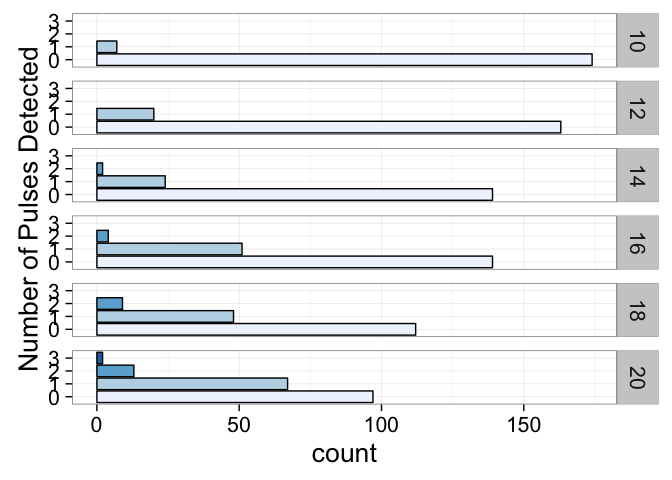\


```r
binNumberPulseCount <- binNumberPulses %>% 
  group_by(binNumber, nPulses) %>%
  summarize(count=n())
```


```r
ggplot(subset(binNumberPulseCount, nPulses<4 & binNumber %in% c(10, 12, 14, 16, 18, 20)), aes(x=nPulses, y=count, fill=factor(binNumber), group=binNumber)) + 
  geom_bar(stat="identity", position="dodge", color="grey20") + 
  scale_fill_brewer(palette = "Blues", name="bins") + 
  labs(x="number of pulses detected") 
```

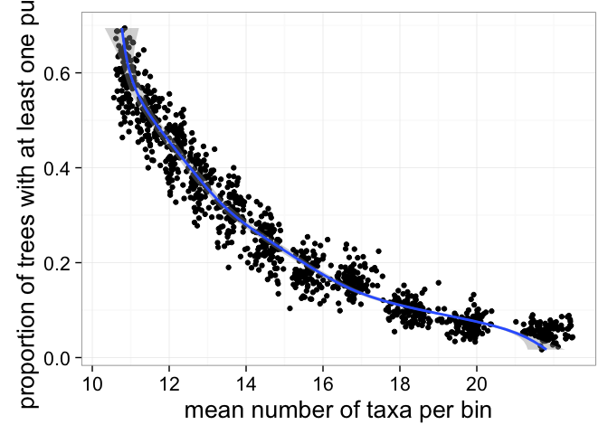\


```r
ggplot(binNumberPulses, aes(x=1, y=nPulses, size=nTaxa)) + 
  geom_point(alpha=1/10) + 
  facet_grid(~binNumber) + 
  scale_x_discrete(labels="") + 
  scale_size_continuous("Taxa in Tree") + 
  theme(axis.ticks.x=element_blank()) + 
  guides(size = guide_legend(override.aes = list(alpha = 1))) + 
  labs(x="number of bins", y="number of pulses detected")
```

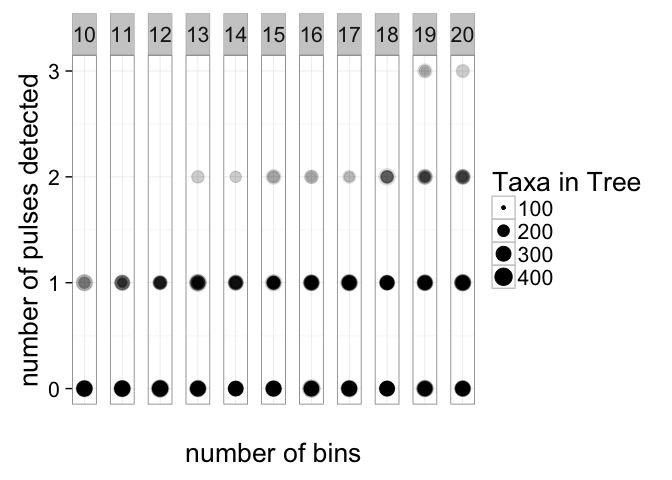\


```r
ggplot(subset(binNumberPulses,binNumber %in% c(10, 12, 14, 16, 18, 20)), aes(x=nPulses, y=nTaxa)) + 
  geom_point(alpha=1/5, size=10) +
  facet_grid(binNumber~.)
```

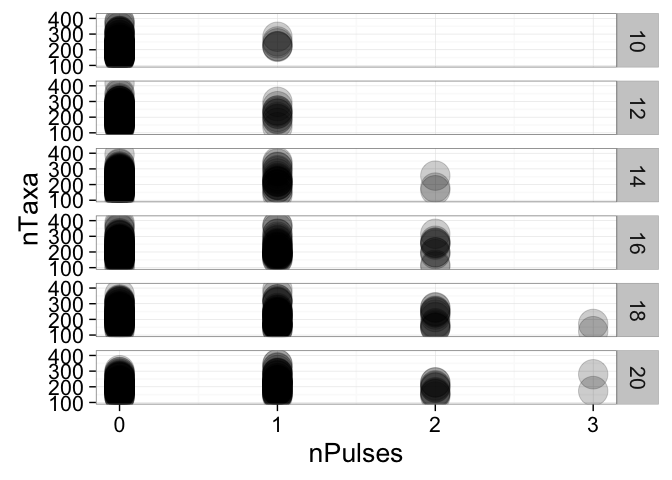\


```r
ggplot(binNumberPulses, aes(x=factor(nPulses), y=nTaxa / binNumber, fill=factor(nPulses))) + 
  geom_boxplot() + 
  scale_fill_brewer(palette = "Blues", guide='none') + 
  labs(x="number of pulses detected", y="mean number of taxa per bin") + 
  coord_flip()
```

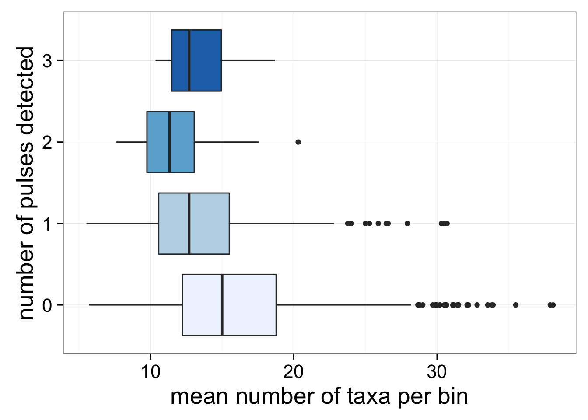\

```r
ggplot(binNumberPulses, aes(x=factor(nPulses), y=nTaxa / binNumber, fill=factor(nPulses))) + 
  geom_violin() + 
  scale_fill_brewer(palette = "Blues", guide='none') + 
  labs(x="number of pulses detected", y="mean number of taxa per bin") + 
  coord_flip()
```

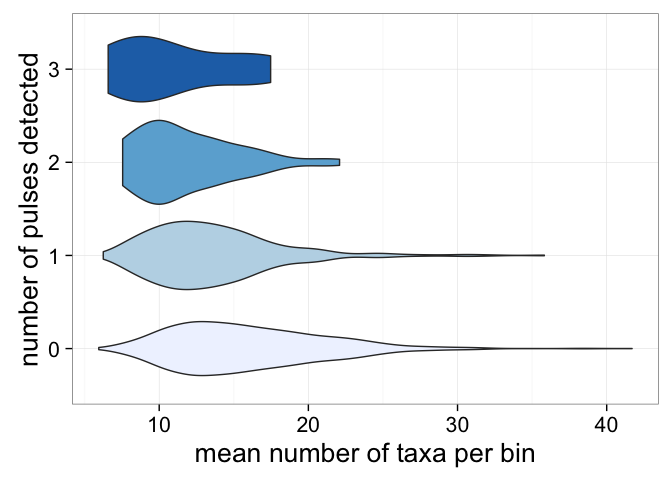\

```r
summary(lm(nTaxa / binNumber ~ factor(nPulses), data=binNumberPulses))
```

```
## 
## Call:
## lm(formula = nTaxa/binNumber ~ factor(nPulses), data = binNumberPulses)
## 
## Residuals:
##      Min       1Q   Median       3Q      Max 
## -10.6043  -3.5935  -0.7131   2.5087  23.1228 
## 
## Coefficients:
##                  Estimate Std. Error t value Pr(>|t|)    
## (Intercept)       15.8543     0.1257 126.167  < 2e-16 ***
## factor(nPulses)1  -2.0770     0.2743  -7.572 5.57e-14 ***
## factor(nPulses)2  -3.6991     0.7077  -5.227 1.91e-07 ***
## factor(nPulses)3  -5.0043     2.0145  -2.484   0.0131 *  
## ---
## Signif. codes:  0 '***' 0.001 '**' 0.01 '*' 0.05 '.' 0.1 ' ' 1
## 
## Residual standard error: 4.925 on 1996 degrees of freedom
## Multiple R-squared:  0.04025,	Adjusted R-squared:  0.03881 
## F-statistic:  27.9 on 3 and 1996 DF,  p-value: < 2.2e-16
```


```r
ggplot(binNumberPulses, aes(x=factor(nPulses), y=binNumber,fill=factor(nPulses))) + 
  geom_boxplot() + 
  scale_fill_brewer(palette = "Blues", guide='none') + 
  labs(x="number of pulses detected", y="number of time bins") + 
  scale_y_continuous(breaks=seq(10, 20, 2)) + 
  coord_flip()
```

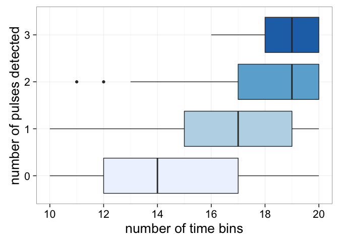\

```r
ggplot(binNumberPulses, aes(x=factor(nPulses), y=binNumber,fill=factor(nPulses))) + 
  geom_violin() + 
  scale_fill_brewer(palette = "Blues", guide='none') + 
  labs(x="number of pulses detected", y="number of time bins") + 
  scale_y_continuous(breaks=seq(10, 20, 2)) + 
  coord_flip()
```

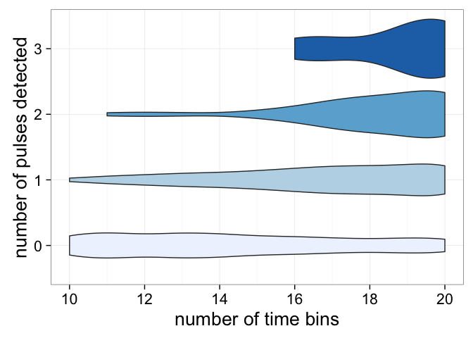\

```r
summary(lm(binNumber ~ factor(nPulses), data=binNumberPulses))
```

```
## 
## Call:
## lm(formula = binNumber ~ factor(nPulses), data = binNumberPulses)
## 
## Residuals:
##    Min     1Q Median     3Q    Max 
## -6.571 -2.388 -0.388  2.429  5.612 
## 
## Coefficients:
##                  Estimate Std. Error t value Pr(>|t|)    
## (Intercept)      14.38802    0.07643 188.248  < 2e-16 ***
## factor(nPulses)1  2.18306    0.16684  13.085  < 2e-16 ***
## factor(nPulses)2  3.57198    0.43046   8.298  < 2e-16 ***
## factor(nPulses)3  4.94531    1.22529   4.036 5.64e-05 ***
## ---
## Signif. codes:  0 '***' 0.001 '**' 0.01 '*' 0.05 '.' 0.1 ' ' 1
## 
## Residual standard error: 2.995 on 1996 degrees of freedom
## Multiple R-squared:  0.1061,	Adjusted R-squared:  0.1047 
## F-statistic: 78.95 on 3 and 1996 DF,  p-value: < 2.2e-16
```

## How many intervals have at least one pulse, of those with less than 10 taxa per interval


```r
forPlot <- binNumberPulses %>% 
  mutate(taxaPerBin = nTaxa/binNumber) %>% 
  filter(taxaPerBin < 10) %>% 
  group_by(binNumber) %>%
  summarize(intervalsWithPulses = sum(nPulses>0)/length(nPulses))

forPlot %>% summarize(mean=mean(intervalsWithPulses))
```

```
## Source: local data frame [1 x 1]
## 
##       mean
##      (dbl)
## 1 0.262657
```

```r
qplot(data=forPlot, xmin=binNumber-0.2, xmax=binNumber+0.2, ymin=0,ymax=intervalsWithPulses, geom="rect") + 
    theme_bw(20) + 
    scale_x_continuous(breaks=10:20) + 
    labs(x="number of bins", y="proportion of trees with pulses")
```

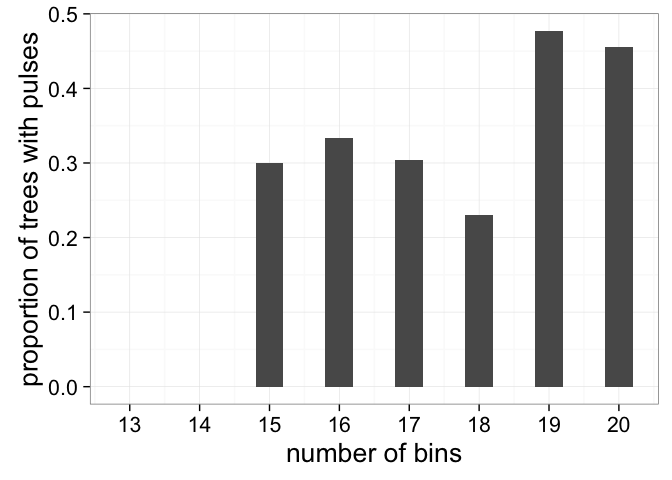\

