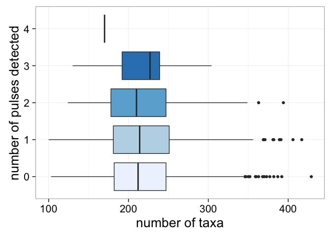

# Untitled
Andrew Barr  
October 20, 2015  


```r
library(ape)
```

```
## Warning: package 'ape' was built under R version 3.2.3
```

```r
library(NullTurnover)
library(ggplot2)
library(parallel)
library(dplyr)
```

```
## 
## Attaching package: 'dplyr'
```

```
## The following objects are masked from 'package:stats':
## 
##     filter, lag
```

```
## The following objects are masked from 'package:base':
## 
##     intersect, setdiff, setequal, union
```

```r
theme_set(theme_bw(20))
knitr::opts_knit$set(fig.width=10, fig.height=10)
```

Trees produced by `phytools::pbtree(bibiP, bibiQ, n=50, t=10)`, using the per interval Foote rate average for the period examined by Bibi & Kiessling. 


```r
treez <- readRDS("treez.Rdata")
```

## Criterion


```r
criteria <- seq(1.2, 1.9, 0.1)
criterionPulses <- mclapply(criteria, mc.cores=4, FUN=function(criterion){
  pulses <- sapply(treez, FUN=function(theTree){
    return(detectPulses(theTree, desiredBinNumber = 20, criterion = criterion)[[1]])
    })
  return(sum(pulses > 0) / length(pulses))
  })
```


```r
qplot(xmin=criteria - 0.03, xmax=criteria + 0.03, ymin=0, ymax=unlist(criterionPulses), geom="rect") + 
  scale_x_continuous(breaks=criteria) + 
  labs(x="Turnover pulse criterion (* IQR)", y="Proportion trees with pulses")
```

\

```r
summary(lm(criteria~unlist(criterionPulses)))
```

```
## 
## Call:
## lm(formula = criteria ~ unlist(criterionPulses))
## 
## Residuals:
##       Min        1Q    Median        3Q       Max 
## -0.038296 -0.028234 -0.001788  0.013488  0.063226 
## 
## Coefficients:
##                         Estimate Std. Error t value Pr(>|t|)    
## (Intercept)              1.91060    0.02420   78.94 2.78e-10 ***
## unlist(criterionPulses) -0.80682    0.04583  -17.60 2.16e-06 ***
## ---
## Signif. codes:  0 '***' 0.001 '**' 0.01 '*' 0.05 '.' 0.1 ' ' 1
## 
## Residual standard error: 0.03646 on 6 degrees of freedom
## Multiple R-squared:  0.981,	Adjusted R-squared:  0.9778 
## F-statistic: 309.9 on 1 and 6 DF,  p-value: 2.157e-06
```


```r
ggsave("FIG-PulseCriterionByPropTreesWithPulses.pdf", height=10, width=10 ,units = "in")
```

## Sample size


```r
nTaxa <- sapply(treez, FUN=function(tree) {
  length(tree$tip.label)
})

summary(nTaxa)
```

```
##    Min. 1st Qu.  Median    Mean 3rd Qu.    Max. 
##   100.0   181.0   213.0   218.1   248.0   429.0
```

```r
nPulses <- sapply(treez, FUN=function(tree){
  detectPulses(tree, desiredBinNumber = 20)
})
summary(nPulses)
```

```
##    Min. 1st Qu.  Median    Mean 3rd Qu.    Max. 
##  0.0000  0.0000  0.0000  0.5935  1.0000  4.0000
```


```r
summary(lm(nTaxa~factor(nPulses)))
```

```
## 
## Call:
## lm(formula = nTaxa ~ factor(nPulses))
## 
## Residuals:
##      Min       1Q   Median       3Q      Max 
## -119.903  -37.443   -5.443   30.558  211.557 
## 
## Coefficients:
##                  Estimate Std. Error t value Pr(>|t|)    
## (Intercept)      217.4427     1.5396 141.231   <2e-16 ***
## factor(nPulses)1   2.4601     2.4075   1.022    0.307    
## factor(nPulses)2  -2.0035     3.9500  -0.507    0.612    
## factor(nPulses)3   0.1173    10.1195   0.012    0.991    
## factor(nPulses)4 -47.4427    50.0319  -0.948    0.343    
## ---
## Signif. codes:  0 '***' 0.001 '**' 0.01 '*' 0.05 '.' 0.1 ' ' 1
## 
## Residual standard error: 50.01 on 1995 degrees of freedom
## Multiple R-squared:  0.001298,	Adjusted R-squared:  -0.0007041 
## F-statistic: 0.6484 on 4 and 1995 DF,  p-value: 0.6281
```

```r
qplot(factor(nPulses), nTaxa, geom="boxplot", fill=factor(nPulses)) + 
  scale_fill_brewer(palette = "Blues", guide="none") + 
  labs(x="number of pulses detected", y="number of taxa") + 
  coord_flip()
```

\

```r
ggsave("FIG-NPulsesByTaxaonCount.pdf", height=10, width=10 ,units = "in")

qplot(factor(nPulses), nTaxa, geom="violin", fill=factor(nPulses)) + 
  scale_fill_brewer(palette = "Blues", guide="none") + 
  labs(x="number of pulses detected", y="number of taxa") + 
  coord_flip()
```

\

## Bin number

*  For each bin number between 10 and 20, inclusive.
*  detect the number of pulses for each of the 2000 trees


```r
binNumberPulses <- readRDS("binNumberPulses.Rdata")
#binNumberPulses <- mclapply(10:20, mc.cores=4, FUN=function(binNumber) {
# nPulses <- sapply(treez, FUN=function(theTree){
#    return(detectPulses(theTree, desiredBinNumber = binNumber))
#    })
# return(list(binNumber = binNumber, nPulses=nPulses))
#})
#
#binNumberPulses <- lapply(binNumberPulses, FUN=function(x){
#  data.frame(nPulses=x$nPulses, binNumber=rep(x$binNumber, length(x$nPulses)), nTaxa=nTaxa, treeID= 1:length(x$nPulses))
#})
#
#binNumberPulses <- do.call(rbind, binNumberPulses)
#saveRDS(binNumberPulses, file="binNumberPulses.Rdata")
```

## Sample trees repeatedly


```r
#sample one from each tree
sampBinNumberPulses <- lapply(1:100, 
                              FUN=function(x){
                                binNumberPulses %>% 
                                  group_by(treeID) %>% 
                                  sample_n(size=1)
                                })
```


## Group by bin Number, record count per bin number and number of trees with at least one pulse


```r
countNumPulses <- lapply(sampBinNumberPulses, FUN=function(x){
  x %>% 
    group_by(binNumber) %>%
    summarise(count=n(), numPulses=sum(nPulses), meanTaxPerBin=mean(nTaxa/binNumber))
})

countNumPulses <- do.call(plyr::rbind.fill, args = countNumPulses)
```


```r
ggplot(countNumPulses, aes(x=numPulses/count, y=meanTaxPerBin)) + 
  geom_point() + 
  labs(x="proportion of trees with at least one pulse", y="mean number of taxa per bin") + 
  scale_y_continuous(breaks=seq(10, 20, 2)) + 
  stat_smooth() + 
  coord_flip()
```

\

```r
ggsave("FIG-ProportionPulsesByMeanTaxaPerBin.pdf", height=10, width=10 ,units = "in")
#this is distinctly non linear, so do I need to do stats?
#summary(lm(nTaxa / binNumber ~ factor(nPulses), data=binNumberPulses))
```


```r
ggplot(subset(countNumPulses, binNumber %in% seq(10, 20, 2)), aes(y=numPulses/count, x=binNumber, group=binNumber, fill=factor(binNumber))) + 
  geom_boxplot() + 
  labs(y="proportion of trees with at least one pulse", x="number of bins") + 
  scale_x_continuous(breaks=seq(10, 20, 2)) + 
  scale_fill_brewer(palette = "Blues", guide='none')
```

\

```r
ggsave("FIG-ProportionPulsesByBinNumber.pdf", height=10, width=10 ,units = "in")
#summary(lm(binNumber ~ factor(nPulses), data=binNumberPulses))
```

