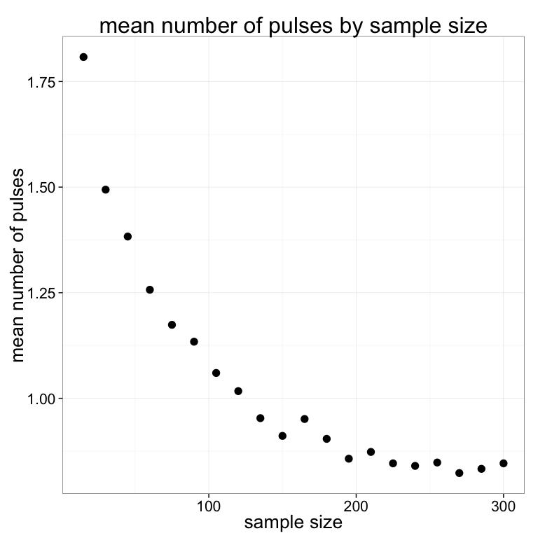
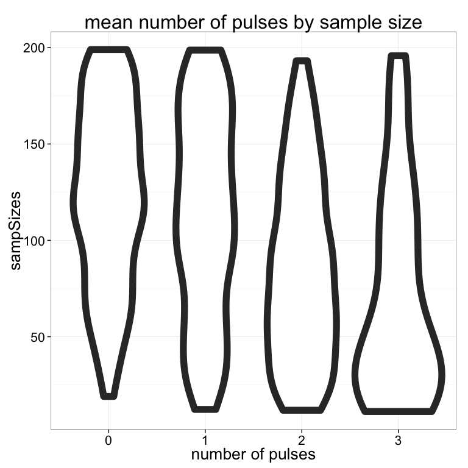
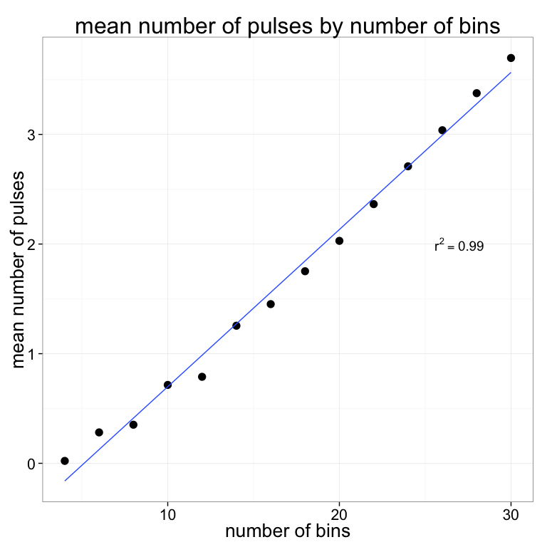
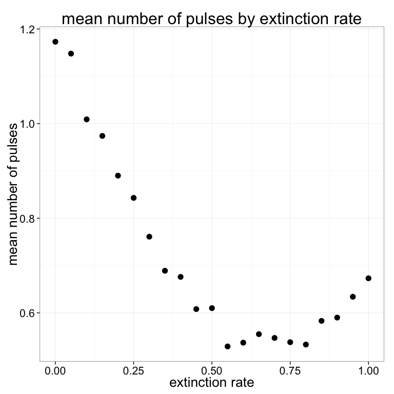
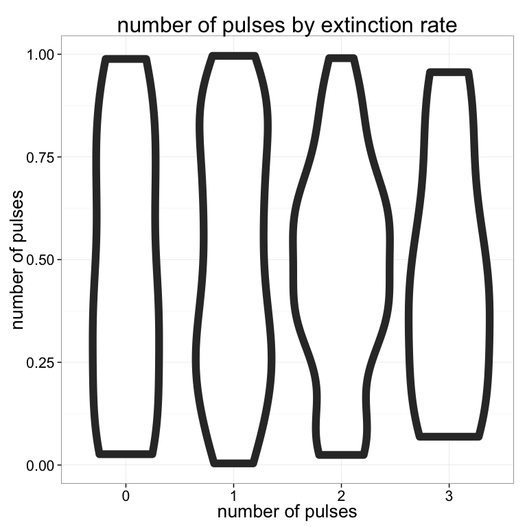
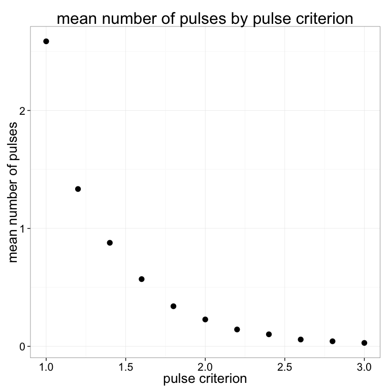
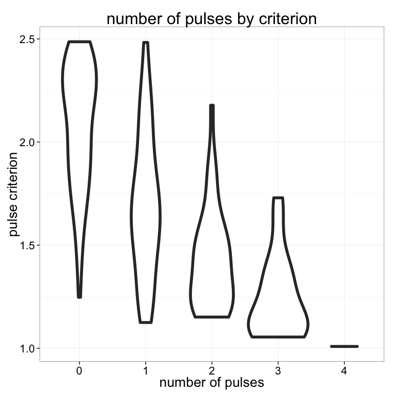
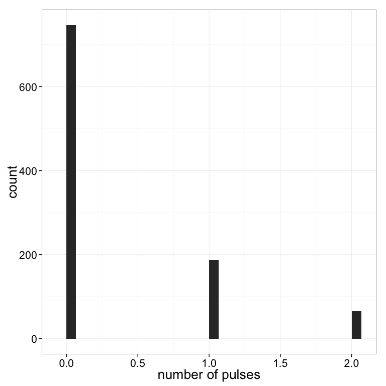

# Analyses-Detect-Pulses
Andrew Barr  
September 28, 2015  


```r
knitr::opts_chunk$set(fig.width=8, fig.height=8, cache=TRUE)
library(parallel)
library(ggplot2)
library(phytools)
library(paleotree)
library(NullTurnover)
theme_set(theme_bw(20))
```


## Does sample size change the number of pulses detected? 


```r
sampSizes <- ceiling(seq(from=15, to=300, by = 15))
sampSizeResults <- lapply(sampSizes, FUN=function(x){
  
  pulses <- mclapply(1:1000, mc.cores=4, FUN=function(y) {
    detectPulses(nTaxa = x, desiredBinNumber = 15, plotRates = FALSE)
  })
  return(mean(unlist(pulses)))
})
```


```r
qplot(sampSizes, unlist(sampSizeResults), size=I(4)) +   
  labs(y="mean number of pulses", title="mean number of pulses by sample size", x="sample size")
```

 

## Yes....larger sample sizes converge to a value...what about variablilty?


```r
sampSizes <- ceiling(runif(1000, min=10, max=200))
sampSizeResults <- lapply(sampSizes, FUN=function(x){

    detectPulses(nTaxa = x, desiredBinNumber = 15, plotRates = FALSE)
 
})
```


```r
qplot(factor(unlist(sampSizeResults)), sampSizes, size=I(4), geom="violin") +  
  labs(x="number of pulses", title="mean number of pulses by sample size", x="sample size")
```

 

## Does bin # change the number of pulses detected? Yes....positively and linearly


```r
binNumbers <- seq(from=4, to=30, by=2)
binNumberResults <- lapply(binNumbers, FUN=function(x){
  
  pulses <- mclapply(1:1000, mc.cores=4, FUN=function(y) {
    detectPulses(nTaxa = 50, desiredBinNumber = x, plotRates = FALSE)
  })
  return(mean(unlist(pulses)))
})
```


```r
summary(lm(unlist(binNumberResults) ~ binNumbers))
```

```
## 
## Call:
## lm(formula = unlist(binNumberResults) ~ binNumbers)
## 
## Residuals:
##       Min        1Q    Median        3Q       Max 
## -0.196593 -0.085278 -0.006963  0.084160  0.183114 
## 
## Coefficients:
##              Estimate Std. Error t value Pr(>|t|)    
## (Intercept) -0.734468   0.072799  -10.09 3.25e-07 ***
## binNumbers   0.143338   0.003869   37.05 9.60e-14 ***
## ---
## Signif. codes:  0 '***' 0.001 '**' 0.01 '*' 0.05 '.' 0.1 ' ' 1
## 
## Residual standard error: 0.1167 on 12 degrees of freedom
## Multiple R-squared:  0.9913,	Adjusted R-squared:  0.9906 
## F-statistic:  1372 on 1 and 12 DF,  p-value: 9.604e-14
```


```r
qplot(binNumbers, unlist(binNumberResults), size=I(4)) +   
  labs(y="mean number of pulses", title="mean number of pulses by number of bins", x="number of bins") + 
  stat_smooth(method="lm", se=F, shape=2) + 
  annotate(27, 2, geom="text", label="r^2==0.99", parse=T)
```

 

## Does extinction rate matter?


```r
exRates <- seq(from=0, to=1, by = 0.05)
exRateResults <- mclapply(exRates, mc.cores=4, FUN=function(x){
  
  pulses <- lapply(1:1000, FUN=function(y) {
    detectPulses(nTaxa = 75, desiredBinNumber = 15, deathRate = x, plotRates = FALSE)
  })
  return(mean(unlist(pulses)))
})
```


```r
qplot(exRates, unlist(exRateResults), size=I(4)) +    
  labs(y="mean number of pulses", title="mean number of pulses by extinction rate", x="extinction rate" )
```

 


```r
extinctionRates <- runif(200)

extinctionRateResults <- lapply(extinctionRates, FUN=function(x){
  detectPulses(nTaxa = 50, desiredBinNumber = 15, plotRates = FALSE)
})
```


```r
qplot(factor(unlist(extinctionRateResults)), extinctionRates, size=I(4), geom="violin") +   
  labs(x="number of pulses", title="number of pulses by extinction rate", y="number of pulses")
```

 

## Sanity check, to make sure that the criterion works like I want it to


```r
criteria <- seq(from=1, to=3, by=0.2)
criteriaResults <- lapply(criteria, FUN=function(x){
  
  pulses <- mclapply(1:1000, mc.cores=4, FUN=function(y) {
    detectPulses(nTaxa = 50, desiredBinNumber = 10, criterion = x, plotRates = FALSE)
  })
  return(mean(unlist(pulses)))
})
```


```r
qplot(criteria, unlist(criteriaResults), size=I(4)) +    
  labs(y="mean number of pulses", title="mean number of pulses by pulse criterion", x="pulse criterion")
```

 


```r
criteria <- runif(200, min=1, max=2.5)

criteriaResults <- lapply(criteria, FUN=function(x){
  detectPulses(nTaxa = 50, desiredBinNumber = 15, criterion = x,  plotRates = FALSE)
})
```


```r
qplot(factor(unlist(criteriaResults)), criteria, size=I(2), geom="violin") +   
  labs(x="number of pulses", y="pulse criterion", title="number of pulses by criterion")
```

 

## How often do you get pulses with parameters like Plio-Pleistocene african bovids?


```r
library(readxl)
```

```
## Warning: package 'readxl' was built under R version 3.1.3
```

```r
bibi <- read_excel("/Users/wabarr/Dropbox/TurnoverPulseRedux/Bibi-Kiessling-PNAS-Supp1.xlsx")

inRange <- function(lowerBound, upperBound, FAD, LAD) {
  ifelse(LAD > lowerBound && FAD < upperBound, return(TRUE), return(FALSE))
}

#how many taxa are in the range 3.75 - 1.25?
sum(sapply(1:nrow(bibi), FUN=function(rowIndex) {inRange(lower=1.25, upper=3.75, FAD=bibi[rowIndex,"FAD"], LAD=bibi[rowIndex,"LAD"])}))
```

```
## [1] 52
```

```r
# what is the extinction rate in that interval, with respect to the originiation rate?
sum(((bibi$LAD < 3.75) * (bibi$LAD > 1.25))) / sum(((bibi$FAD < 3.75) * (bibi$FAD > 1.25)))
```

```
## [1] 0.8533333
```

```r
bibiResults <- sapply(1:1000, FUN=function(x) detectPulses(treeDepth = 2.5, criterion = 1.5, nTaxa=52, desiredBinNumber = 10, deathRate =  0.8533333))
```


```r
sum(bibiResults > 0) / length(bibiResults)
```

```
## [1] 0.254
```

```r
qplot(bibiResults) +  
  labs(x="number of pulses")
```

```
## stat_bin: binwidth defaulted to range/30. Use 'binwidth = x' to adjust this.
```

 
